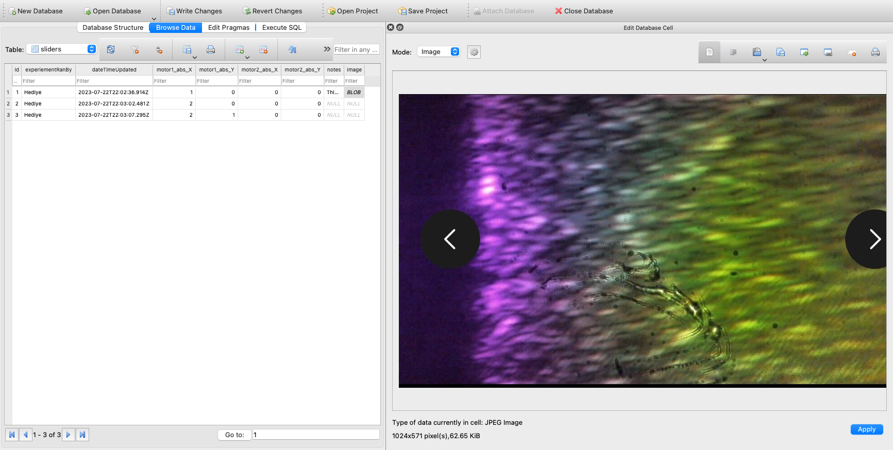
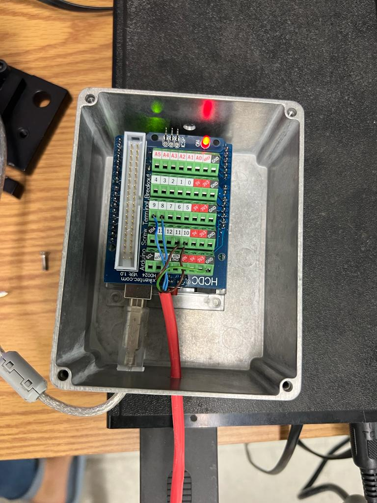

This system will create an experimental log that looks like this:



Updated on 7/24:


The app controlling the mirrors look like this:


Updated on 7/24:


The lab setup looks like this:


The arduino controlling the mirrors looks like this:


Updated on 7/24:


# How to run this app on mac?

git clone https://github.com/sjsu-smallwood-group/mirror-control-js.git
cd mirror-control

Subsystem1: Run gui
Subsystem2: Run serial-port-communicator
Subsystem3: Run code-on-arduino

> ./run-gui-serial-port-com.sh

## System diagram

```
+-----------+   USB   +------------+   Wires  +--------------+         +--------------+
| Computer  | <-----> | Arduino UNO| <------> |Mirror DriverA| <------>|    Mirror 1  |
|           |         |            |          | Picomotor    |         |              |
| running   |         | running    |          | Model: 8801  |         |              |
|           |         |            |          +--------------+         +--------------+
| electron  |         | take-      |
| gui       |         | serial-    |   Wires  +--------------+         +--------------+
|           |         | input.ino  | <------> |Mirror DriverB| <------>|    Mirror 2  |
+-----------+         +------------+          | Picomotor    |         |              |
                                              | Model: 8801  |         |              |
                                              +--------------+         +--------------+
```

# How to view the experimental logs?

1. Install https://sqlitebrowser.org/dl/

2. Then open the file experiments-notebook.sqlite inside the db browser app.

3. Catch up knowledge is at: https://www.youtube.com/watch?v=b0Dplx4M5zg

# What are the column names in the experimental log book?

```
CREATE TABLE tblObservations(
    id INTEGER PRIMARY KEY,
    material TEXT,
    experiementRanBy TEXT,
	temperature_kelvin TEXT,
	dateTimeUpdated TEXT,
    motor1_abs_X INTEGER,
	motor1_abs_Y INTEGER,
    motor2_abs_X INTEGER,
    motor2_abs_Y INTEGER,
    notes TEXT,
	image BLOB
  )
```
