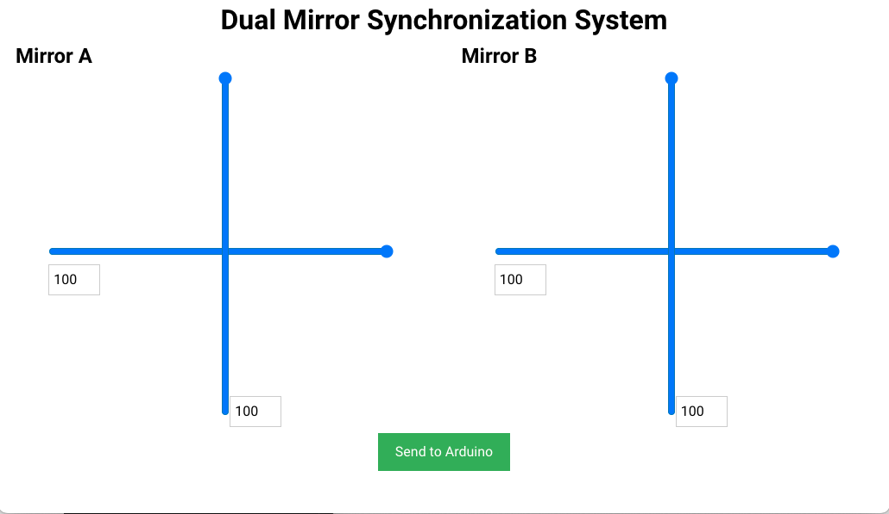

# How to run this app on mac?

## System diagram

```
+-----------+   USB   +------------+   Wires  +--------------+         +--------------+
| Computer  | <-----> | Arduino UNO| <------> | Mirror Driver| <------>|    Mirror    |
|           |         |            |          | Picomotor    |         |              |
| running   |         | running    |          | Model: 8801  |         |              |
|           |         |            |          +--------------+         +--------------+
| electron  |         | take-      |
| gui       |         | serial-    |   Wires  +--------------+         +--------------+
|           |         | input.ino  | <------> | Mirror Driver| <------>|    Mirror    |
+-----------+         +------------+          | Picomotor    |         |              |
                                              | Model: 8801  |         |              |
                                              +--------------+         +--------------+
```
