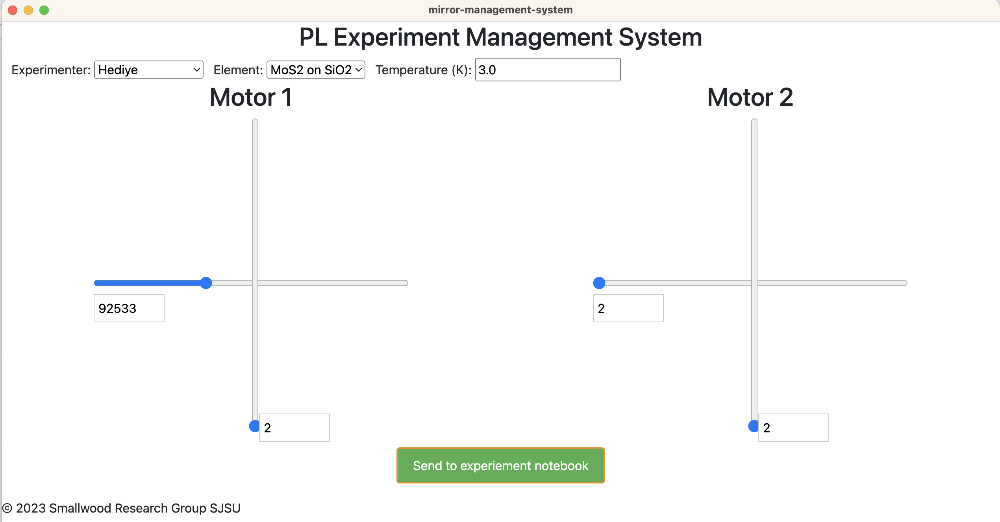

This system will create an experiment notebook that looks like this:


The app controlling the mirrors look like this:



The lab setup looks like this:


The arduino controlling the mirrors looks like this:


# How to run this app on mac?

## Step 1

```
git clone https://github.com/sjsu-smallwood-group/mirror-control-js.git
cd mirror-control
> ./run-gui-serial-port-com.sh
```

The above script will start 2 subsystems:
Subsystem1: Run gui
Subsystem2: Run serial-port-communicator

## Step 2

After step 1 we need to start Subsystem3 i.e the app on arduino. To do that, you need to open the arduino IDE and open the file `code-on-arduino/take-serial-input.ino` and then click the upload button.

# System diagram

```
+-----------+   USB   +------------+   Wires  +--------------+         +--------------+
| Computer  | <-----> | Arduino UNO| <------> |Mirror DriverA| <------>|    Mirror 1  |
|           |         |            |          | Picomotor    |         |              |
| running   |         | running    |          | Model: 8801  |         |              |
|           |         |            |          +--------------+         +--------------+
| electron  |         | take-      |
| gui       |         | serial-    |   Wires  +--------------+         +--------------+
|           |         | input.ino  | <------> |Mirror DriverB| <------>|    Mirror 2  |
+-----------+         +------------+          | Picomotor    |         |              |
                                              | Model: 8801  |         |              |
                                              +--------------+         +--------------+
```

# How to view the experimental logs?

1. Install https://sqlitebrowser.org/dl/

2. Then open the file experiments-notebook.sqlite inside the db browser app.

3. Catch up knowledge is at: https://www.youtube.com/watch?v=b0Dplx4M5zg

# What are the column names in the experimental log book?

```
CREATE TABLE tblObservations(
    id INTEGER PRIMARY KEY,
    material TEXT,
    collaborator TEXT,
    experiementRanBy TEXT,
    temperature_kelvin TEXT,
    dateTimeUpdated TEXT,
    motor1_abs_X INTEGER,
    motor1_abs_Y INTEGER,
    motor2_abs_X INTEGER,
    motor2_abs_Y INTEGER,
    notes TEXT,
    image BLOB
)
```
