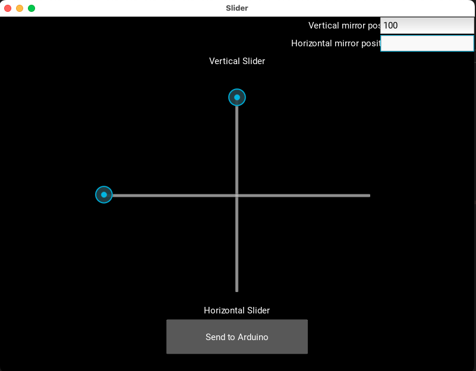

This controls the mirror using a GUI app running on the computer to which Arduino is connected using the USB port.

## The UI of this app is:



## Steps to run it on your mac

```
pip3 install kivy
python3 gui.py
```
